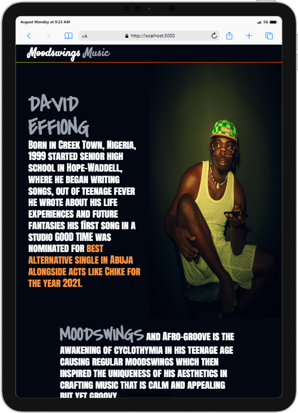
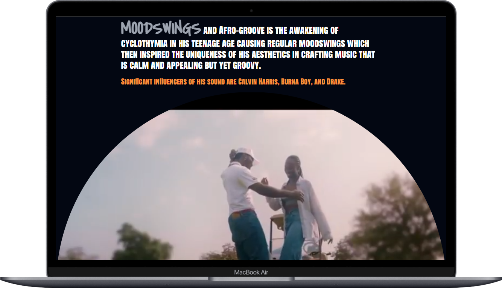

# Moodswings Music Player

## Description

Moodswings is an inspiring artist, he's a gateway to the unique world of Afro Groove. Born from a collaboration between friends, this app serves as a platform for an emerging artist to share his innovative sound with the world. 

Moodswings music app is a sleek, React-based web application. The star of the show is the custom-built MP3 player, complete with a visually striking rotating disk plate that adds a touch of analog charm to the digital interface.

## Features
- An animated linear gradient border at the header area
- An mp4 music video
- Rotating disk
- An mp3 music player
- Controls - play/pause, skip/previous, loop/shuffle tracks
- Smooth progress bar for track navigation
- Responsive design for various screen sizes

## Technologies Used
- React.js
- Tailwind CSS

## Installation
To run this project locally:

1. Clone the repository
2. Navigate to the project directory
3. Install dependencies
4. Start the development server

## Usage
- Simply scroll down to the mp3 player section to listen, controls are available as well to navigate through the music list.

## Screenshots

## Contributing
Contributions to improve Moodswings are welcome.

## License
[MIT License]

## Contact
Aesthetic Dee - [aestheticdee.mail@gmail.com]

Project Link: [https://github.com/Aesthetic-Dee/Moodswings-App]
